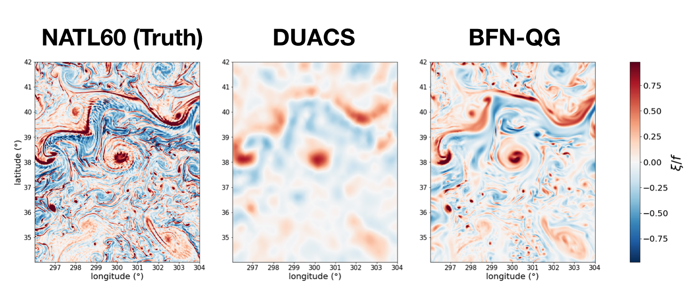

# MASSH
MApping SSH 


## Examples
### 1. BFN-QG with SWOT & Nadir data

This example is taken from a [SSH Mapping Data Challenge (2020a)](https://github.com/ocean-data-challenges/2020a_SSH_mapping_NATL60). It considers realistic simulated SWOT and Nadir observations extracted from a state-of-the-art high resolution ocean model [NATL60](https://meom-group.github.io/swot-natl60/science.html). The example shows how to run a BFN-QG (Le Guillou et al., 2020) experiment to estimate high resolution gridded SSH. 
#### Download the data
The data is hosted [here](https://ige-meom-opendap.univ-grenoble-alpes.fr/thredds/catalog/meomopendap/extract/ocean-data-challenges/dc_data1/catalog.html) with the following directory structure

```
. 
|-- dc_obs
|   |-- 2020a_SSH_mapping_NATL60_topex-poseidon_interleaved.nc
|   |-- 2020a_SSH_mapping_NATL60_nadir_swot.nc 
|   |-- 2020a_SSH_mapping_NATL60_karin_swot.nc
|   |-- 2020a_SSH_mapping_NATL60_jason1.nc
|   |-- 2020a_SSH_mapping_NATL60_geosat2.nc
|   |-- 2020a_SSH_mapping_NATL60_envisat.nc

|-- dc_ref
|   |-- NATL60-CJM165_GULFSTREAM_y****m**d**.1h_SSH.nc

```

To start out create a directory ```data_Example1```
```shell
mkdir data_Example1
```

In this directory, download the *observation* dataset (dc_obs, 285M) using : 
```shell
cd data_Example1
wget https://ige-meom-opendap.univ-grenoble-alpes.fr/thredds/fileServer/meomopendap/extract/ocean-data-challenges/dc_data1/dc_obs.tar.gz --no-check-certificate
```
the *reference* dataset (dc_ref, 11G) using (*this step may take several minutes*) : 

```shell
wget https://ige-meom-opendap.univ-grenoble-alpes.fr/thredds/fileServer/meomopendap/extract/ocean-data-challenges/dc_data1/dc_ref.tar.gz --no-check-certificate
```

and the DUACS maps that will be used as boundary conditions
```shell
wget https://ige-meom-opendap.univ-grenoble-alpes.fr/thredds/fileServer/meomopendap/extract/ocean-data-challenges/dc_data1/dc_mapping/2020a_SSH_mapping_NATL60_DUACS_swot_en_j1_tpn_g2.nc --no-check-certificate
```

Then uncompress the files using `tar -xvf <file>.tar.gz`. You may also use `ftp`, `rsync` or `curl`to donwload the data.  


#### Run the notebook
In ```mapping/example``` open the notebook ```Èxample1.ipynb```, associated with the configuration file called ```config_Example1.py```

### 2. 4Dvar-SW with (idealized) 2D SSH data
#### Download the data
```shell
mkdir data_Example2
cd data_Example2
wget https://ige-meom-opendap.univ-grenoble-alpes.fr/thredds/fileServer/meomopendap/extract/LeGuillou/data_BM-IT_idealized.tar.gz  --no-check-certificate
tar -xvf data_BM-IT_idealized.tar.gz
```
#### Run the notebook
In ```mapping/example``` open the notebook ```Èxample2.ipynb```, associated with the configuration file called ```config_Example2.py```
