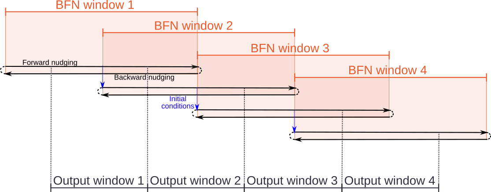
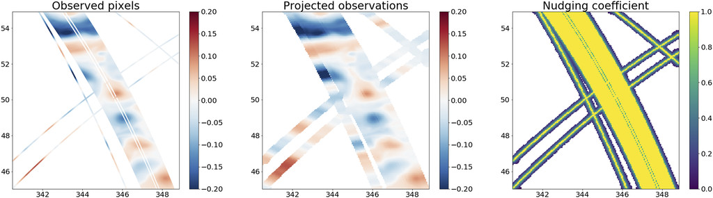

Back and Forth Nudging
======================

The Back and Forth Nudging (BFN) technique is a data assimilation technique first introduced by Auroux and Blum (2008). 
It has been recently tested by Le Guillou et al (2021) on realistic SSH observations both provided by conventional (1D) and wide-swath (2D) altimeters. 

Method
------
The BFN relies on the nudging technique.
The nudging technique is a conceptually simple data assimilation method first employed in the meteorological context (Hoke and Anthes, 1976). 
It consists in adding a feedback term to the prognostic equation of the model. The feedback term is proportional to the difference between the observations and the state of the model:

.. math::
    \label{nudg}
    \frac{\partial X}{\partial t} = \mathcal{M}(X,t) + K(Y-X)

where :math:`K`, called the nudging coefficient, has the dimension of the inverse of time. 
The value of :math:`K` determines the strength of the relaxation: the higher the value, the more the observation will impact the trajectory of the model.

The forward (backward) nudging is defined as the forward (backward) integration of the previous equation, starting from an initial (final) condition and with :math:`K>0` (:math:`K<0`).

The BFN is the iterative combination of the forward nudging and the backward nudging over a fixed time interval. 
Assuming the initial state of the model is given, the forward nudging is first computed. 
The final state obtained by the forward propagation is then used as initial condition to run the backward nudging. 
The algorithm converges in several iterations toward a trajectory that both fits the observations and complies with the model dynamics. 
This data assimilation method shares analogies with four-dimensional variational (4DVar; see next section) assimilation, in that both solve the problem of finding a model trajectory over a fixed-time interval, which best fits observations within this interval. 
The implementation of the BFN is easier because it does not require the minimization tools needed by the 4DVar.

Time windows
------------

The BFN runs in a main time window of length :math:`T` as explained previously.
Moreover, a saving interval window is defined with length smaller than :math:`T`. This window is centred
in the frst one, and it selects the values that are saved as BFN output once the convergence is
achieved. As all the values of a BFN window are not saved, there is a need to overlap the BFN
windows as shows in the previous figure. The initial point of the starting BFN window will be taken from
the result of the previous BFN window, except for the frst BFN window.

Nudging strategy
----------------

Each BFN time window is discretized in several assimilation time windows. 
All the observations belonging to a specific assimilation time window and measuring the same physical quantity are merged all together (see left panel on the previous figure).
In order to avoid numerical instabilities due to strong spatial gradient, the observations and the nudging coefficient are spread in space (as depected on the figure).
Besides, in order to apply a sufficient strong constrain on the model, the observations are spread in time. 
Mathematically, for each nudging operation, the nudging coefficient at time :math:`t` and at the model grid point :math:`x` can be written as:

.. math::
    K(x,t)=K_0e^{-\left(\frac{t-t_a}{T}\right)^2}e^{-\left(\frac{d(x)}{D}\right)^2}

where :math:`K_0` is the nominal value of the nudging coefficient, :math:`t_a` is the middle of the assimilation time window, 
:math:`T` and :math:`D` are the time and space scales on which the nudging operation is applied, and :math:`d(x)` is the
distance between the considered grid point and the observations (if this distance is below the grid resolution, it is set to 0).

Configuration parameters
------------------------

Here are the parameters specific to the BFN technique to be prescribed in the configuration file. 
If some are not prescribed, then the default values shown hereafter will be used.

.. code-block:: python

    # length of the bfn time window
    bfn_window_size = timedelta(days=7) 

    # length of the output time window, in the middle of the bfn window. (need to be smaller than *bfn_window_size*)
    bfn_window_output = timedelta(days=3) 

    # Assimilation time window, corresponding to the time step at which the nudging term is computed
    bfn_propation_timestep = timedelta(hours=1) 

    # Whether to overlap the BFN windows or not (True or False)
    bfn_window_overlap = True 

    # Convergence criterion. typical value: 0.01
    bfn_criterion = 0.01 

    # Maximal number of iterations if *bfn_criterion* is not met
    bfn_max_iteration = 5 

    # Save or not the back and forth iterations (for debugging)
    save_bfn_trajectory = False 

    # Distance (in km) for which observations are spatially spread
    dist_scale = 10 

    # Save or not the projected observation as pickle format. Set to True to maximize the speed of the algorithm.
    save_obs_proj = False 

    # Path to save projected observations
    path_save_proj = None 

    # Whether to use boundary conditions as initialization for the first temporal window
    bfn_use_bc_as_init = False
