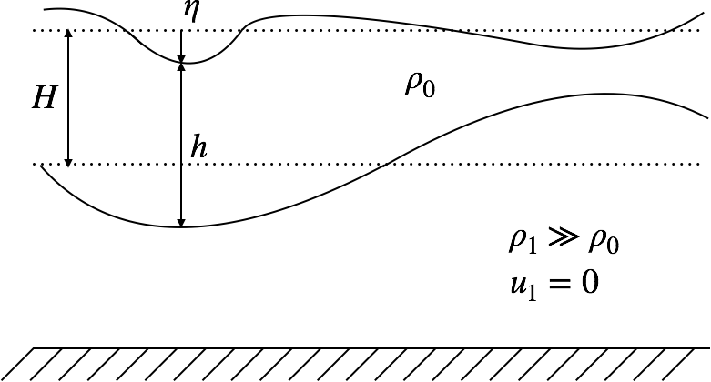

1.5-layers Quasi-Geostrophic model
==================================

Equations solved
----------------

We model the ocean by the superposition of one dynamical thin upper layer on top of a denser and thicker static layer, with flat bathymetry (see figure).

The adiabatic Quasi-Geostrphic (QG) dynamics in the 1.5-layer model are governed by the conservation of Potential Vorticity (PV), :math:`q`, whose prognostic equation without atmospheric forcing is:

.. math:: 
   \frac{\partial q}{\partial t} + \mathbf{u_g} \cdot \nabla q = 0

where :math:`\mathbf{u_g}` is the geostrophic velocity vector diagnosed from streamfunction :math:`\psi`, proportional to SSH :math:`\eta`: 

.. math::
  \mathbf{u_g}=-\mathbf{k}\times \mathbf{\psi}=-\frac{g}{f} \mathbf{k}\times \mathbf{\nabla} \eta 

:math:`\mathbf{k}` denotes the vertical direction, :math:`g` the gravity constant, and :math:`f` the Coriolis parameter. The PV is linked to the streamfunction by the elliptical equation: 

.. math::
   q=\nabla^{2}\psi - {\frac {f^2}{{c_1}^{2}}}\psi

where :math:`c_1` is the first baroclinic phase velocity.

Formulation with Sea Level Anomalies
------------------------------------

In reality, an altimeter only provides accurate observations of the time-fluctuating part of SSH, called Sea Level Anomaly (SLA). The time-averaged of SSH, called Mean Dynamical Topography (MDT) is computed with the combination of data and other satellite observations. 

To formulate the QG dynamics with the SLA variable, we decompose the geostrophic velocity and the PV using the Reynolds decomposition:

.. math::
   \begin{aligned}
        \mathbf{u_g}&=\overline{\mathbf{u_g}}+\mathbf{u_g}' \\
        q &= \overline{q}+q'
   \end{aligned}

where :math:`\overline{\mathbf{u_g}}` and :math:`\overline{q}` stand for the mean components (SLA-independent) and :math:`\mathbf{u_g'}` and :math:`q'` the time-fluctuating components (diagnosed from SLA).

The prognostic equation for the potential vorticity fluctuation is then:

.. math::
   \frac{\partial q'}{\partial t} + \mathbf{\overline{u_g}} \cdot \nabla q' + \mathbf{u_g'} \cdot \nabla \overline{q} +   \mathbf{u_g'} \cdot \nabla q' = 0

Numerical implementations
-------------------------
The numerical codes of the model are located in the ``mapping/models/model_qg1l`` directory. Two different implementations of the model are provided:
        - ``qgm.py`` with the ``numpy`` python library;
        - ``jqgm.py`` with ``jax`` python library, enabling automatic differentiation for 4Dvar data assimilation technique.

The time stepping from time :math:`t_i` to :math:`t_{i+1}` is implemented as follows. 
        - The  PV :math:`q_i` is diagnosed from :math:`\eta_i` (see ``Qgm.h2pv`` function). 
        - :math:`q_{i+1}` is computed by integrating the prognostic equation (see ``Qgm.qrhs`` function).  
        - :math:`\psi_{i+1}` (and therefore :math:`\eta_{i+1}`) is obtained by inverting the elliptical equation using a gradient conjugate technique (see ``Qgm.pv2h`` function).  

Both forward Euler and fourth-order Runge-Kutta time schemes are implemented (see ``Qgm.step_euler`` and ``Qgm.step_rk4`` functions respectively). 

The advection can be performed either with first, second, or third upwind spatial schemes (see ``Qgm._rq1``, ``Qgm._rq2`` and ``Qgm._rq3`` functions respectively). 

Both ``numpy`` and ``jax`` implementations allow Reynolds decomposition, with the prescription of a mean field such as the one provided by the MDT CMEMS products (see Example ???). In addition, ``jax`` impelmentation allows to consider multiscale QG formulation, closed to the SLA formulation, but with a time-variable 'mean' flow, that we can associate to the large spatial scales (see ``jqgm.Qgm.step_multiscales`` function). This will be useful for providing background data in data assimilation experiments (see Example ???). 

Configuration parameters
------------------------
Here are the parameters specific to the model to be prescribed in the configuration file. If some are not prescribed, then the default values shown hereafter will be used.

.. code-block:: python

   # Name of the model. Either:
   # 'QG1L': numpy implementation of the model
   # 'JAX-QG1L': JAX implementation of the model
   # 'QG1LM': JAX implementation of the multiscale model
   name_model = 'QG1L'

   # Time scheme of the model (e.g. Euler,rk4)
   qg_time_scheme = 'Euler' 

   # Order of the upwind scheme for PV advection (either 1,2 or 3)
   upwind = 3 

   # Order of the upwind scheme for adjoint PV advection (either 1,2 or 3).
   # Only relevent for 4Dvar assimilation scheme.
   # If None, default value is set equal to upwind. 
   upwind_adj = None 

   # Number of iterations to perform the gradient conjugate algorithm in the QG elliptical equation 
   qgiter = 20 

   # Number of iterations to perform the gradient conjugate algorithm in the adjoint QG elliptical equation 
   # Only relevent for 4Dvar assimilation scheme.
   # If None, default value is set equal to qgiter. 
   qgiter_adj = None 

   # First baroclinic phase velocity
   c0 = 2.7 

   # Path of the auxilliary file to be used as phase velocity field. 
   # Spatial interpolation is handled inline
   # c0 has to be set to None
   filec_aux = None 

   # Variable names for the phase velocity auxilliary file 
   name_var_c = {'lon':'','lat':'','var':''} 

   # Whether to use Reynolds decomposition or not (True or False). 
   # Observed variable has to be SLA and MDT has to be provided
   Reynolds = False 

   # Path of the auxilliary file to be used as MDT
   # Spatial interpolation is handled inline
   path_mdt = None 

   # Variable names for the MDT auxilliary file 
   # If 'mdu' and 'mdv' are None, the mean currents will be computed thanks to MDT and the geostrophy assumption
   name_var_mdt = {'lon':'','lat':'','mdt':'','mdu':None,'mdv':None} 

   # Diffusion coefficient
   # Note: here the diffusion is done on PV (instead of SSH in the Diffusion model, previous section)
   Kdiffus = 0

   # Whether to use only diffusion or not.
   # Useful for quick tests
   only_diffusion = False

