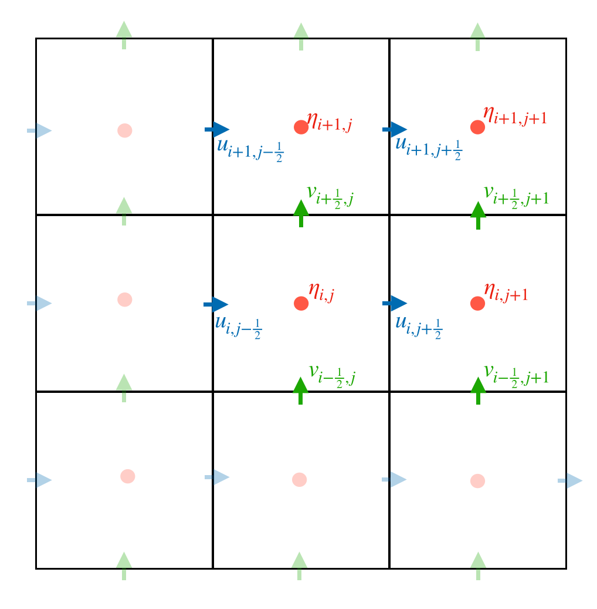

Linear Shallow-Water model
==========================

Equations solved
----------------

The equations of the linear Shallow-Water (SW) model are:

.. math::
   \begin{aligned}
    \partial_t{u} - fv &= - g \partial_x{\eta} \\
    \partial_t{v} + fu &= - g \partial_y{\eta} \\
    \partial_t{\eta} &= - H_e \left( \partial_x{u} + \partial_y{v} \right)
   \end{aligned}

where :math:`(u,v)` are the velocity components, :math:`\eta` is the SSH, :math:`f` is the Coriolis frequency, and :math:`H_e` the equivalent depth that determines the baroclinic deformation radius (through the relation :math:`R_d=\sqrt{gH_e}/f`).

Open boundary conditions 
------------------------

Open Boundary Conditions (OBCs) are designed to introduce and let out signal in and out the model domain. They are of the radiative type, implemented with the Flather condition:

.. math::
   v^n \pm \sqrt{\frac{g}{H_e}}\eta = {v^n}_\mathrm{ext} \pm \sqrt{\frac{g}{H_e}} \eta_\mathrm{ext}

where :math:`v^n` is the normal component of the wave velocity at the boundary. Parameters :math:`{v^n}_\mathrm{ext}` and :math:`\eta_\mathrm{ext}` must be prescribed. The signs in the above equation vary with the boundary (:math:`-` for southern and western boundaries, :math:`+` for the others)

Numerical implementations
-------------------------

The numerical codes of the model are located in the ``mapping/models/model_sw1l`` directory.

The equations are discretized on a Arakawa C-grid where SSH and velocity components are not co-located. The u-components are located at the centers of the left and right grid faces, the v-components are located at the centers of the upper and lower grid faces and the η-components are located at the center grid (see figure).

The temporal derivatives are discretized using either a forward Euler, leap-frog or a fourth-order Runge Kutta scheme (see ``Swm.step_euler``, ``Swm.step_lf``  and ``Swm.step_rk4`` functions respectively in ``swm.py`` script). 

Specific implementation of OBCs
-------------------------------

With only the normal component of the velocity
^^^^^^^^^^^^^^^^^^^^^^^^^^^^^^^^^^^^^^^^^^^^^^

OBCs are derived by computing the characteristic variables of the system on each border of the domain (see ``obcs.py`` script). 

Lets call :math:`\textbf{u}=(u,v)` the velocity vector, :math:`\textbf{n}=(n_x,n_y)` the outward normal vector and :math:`c=\sqrt{H_e g}`. The characteristic variables, associated to the eigenvalues :math:`(\lambda_1=-c,\lambda_2=0,\lambda_3=c)`, are:

.. math::
        \begin{aligned}
                w_1 &= \textbf{u}\cdot\textbf{n} - \sqrt{\frac{g}{H_e}}\eta \\
                w_2 &= \textbf{u}\times\textbf{n} \\
                w_3 &= \textbf{u}\cdot\textbf{n} + \sqrt{\frac{g}{H_e}}\eta \\
        \end{aligned}

As we have no forcing terms in the prognostic equations, the characteristic variables are transported according to:

.. math::
    \begin{aligned}
        \partial_t{w_1} - c\partial_x{w_1}&=0  \label{eq:w1}\\
        \partial_t{w_2} &= 0 \label{eq:w2}\\
        \partial_t{w_3} + c\partial_x{w_3}&=0  \label{eq:w3}
    \end{aligned}
    \label{eq:w}

where here :math:`x` denotes the spatial coordinate normal to the border, which can be along the meridional or the zonal direction. :math:`w_1` is always incoming in the domain and must be prescribed thanks to external data :math:`({u}_\mathrm{ext},{v}_\mathrm{ext},{\eta}_\mathrm{ext})`:

.. math::
    \begin{cases}
        {w_1^{n+1}}_{i,\frac{1}{2}} := u^{n+1}_{i,\frac{1}{2}} + \sqrt{\frac{g}{H_e}}\eta^{n+1}_{i,\frac{1}{2}}=u^{ext} + \sqrt{\frac{g}{H_e}}\eta^{ext}& \text{on the Western border }\\
         {w_1^{n+1}}_{i,N_x+\frac{1}{2}} := u^{n+1}_{i,N_x+\frac{1}{2}} - \sqrt{\frac{g}{H_e}}\eta^{n+1}_{i,N_x+\frac{1}{2}}=u^{ext} - \sqrt{\frac{g}{H_e}}\eta^{ext}& \text{on the Eastern border }\\
         {w_1^{n+1}}_{\frac{1}{2},j} := v^{n+1}_{\frac{1}{2},j} + \sqrt{\frac{g}{H_e}}\eta^{n+1}_{\frac{1}{2},j}=v^{ext} + \sqrt{\frac{g}{H_e}}\eta^{ext}& \text{on the Southern border }\\
         {w_1^{n+1}}_{N_y+\frac{1}{2},j} := v^{n+1}_{N_y+\frac{1}{2},j} - \sqrt{\frac{g}{H_e}}\eta^{n+1}_{N_y+\frac{1}{2},j}=v^{ext} - \sqrt{\frac{g}{H_e}}\eta^{ext}& \text{on the Northern border }\\
    \end{cases}

:math:`w_3` is always outgoing from the domain and needs to be computed on the borders:

.. math::
    \begin{cases}
        {w_3^{n+1}}_{i,\frac{1}{2}} := u^{n+1}_{i,\frac{1}{2}} - \sqrt{\frac{g}{H_e}}\eta^{n+1}_{i,\frac{1}{2}}& \text{on the Western border }\\
         {w_3^{n+1}}_{i,N_x+\frac{1}{2}} := u^{n+1}_{i,N_x+\frac{1}{2}} + \sqrt{\frac{g}{H_e}}\eta^{n+1}_{i,N_x+\frac{1}{2}}& \text{on the Eastern border }\\
         {w_3^{n+1}}_{\frac{1}{2},j} := v^{n+1}_{\frac{1}{2},j} - \sqrt{\frac{g}{H_e}}\eta^{n+1}_{\frac{1}{2},j}& \text{on the Southern border }\\
         {w_3^{n+1}}_{N_y+\frac{1}{2},j} := v^{n+1}_{N_y+\frac{1}{2},j} + \sqrt{\frac{g}{H_e}}\eta^{n+1}_{N_y+\frac{1}{2},j}& \text{on the Northern border }\\
    \end{cases}

In the following, we state that we know :math:`(u^{n+1},v^{n+1},\eta^{n+1})` inside the domain, and the aim is to prescribe their values at the borders. However, only the pixels of normal component of the velocity are located on the border. The tangential component of the velocity and the sea level have to be estimated on the borders. For that purpose, we need to consider ghost pixels located at a half-grid point outside the boundary row. For instance, for the eastern border, we need to compute :math:`v^n_{i+\frac{1}{2},N_x+\frac{1}{2}}` and  :math:`\eta^n_{i,N_x+\frac{1}{2}}` such as:

.. math::
   \begin{aligned}
        \eta^n_{i,N_x+\frac{1}{2}}&=\frac{1}{2}\left(\eta^n_{i,N_x}+\eta^n_{i,N_x+1}\right) \label{eq:ghost_eta}\\
        v^n_{i+\frac{1}{2},N_x+\frac{1}{2}}&=\frac{1}{2}\left(v^n_{i+\frac{1}{2},N_x}+v^n_{i+\frac{1}{2},N_x+1}\right) \label{eq:ghost_u}\\
   \end{aligned}

where :math:`v^n_{i+\frac{1}{2},N_x}` and :math:`\eta^n_{i,N_x+1}` are the ghost variables.

As the ghost pixels are not influenced by the interior dynamics, they have to be carefully initialized to well define the OBCs at the first time-step. To do so, the external conditions are extrapolated from the borders to the ghost pixel locations. 

Setting OBCs is then a succession of three steps:

    - We compute the incoming characteristic :math:`w_1` on the borders at time :math:`t^{n+1}` using external prescribed data at time :math:`t^{n}`.
    - We compute the outgoing characteristic :math:`w_3` on the borders at time :math:`t^{n+1}` using internal model data at time :math:`t^{n}`.
    - We deduce the normal component of the velocity and SSH on the border thanks to :math:`w_1` and :math:`w_3` and the tangent component of the velocity thanks to ghost pixels at time :math:`t^{n}`.
    - We update the ghost values at time :math:`t^{n+1}`.

Taking into account tangential velocity gradients
^^^^^^^^^^^^^^^^^^^^^^^^^^^^^^^^^^^^^^^^^^^^^^^^^^

As an example, we consider the western boundary. We add the gradient of :math:`v` along the border in the transport equation of :math:`w_1` and :math:`w_3` such as:

.. math::
    \begin{aligned}
        \partial_t{w_1} + c\partial_x{w_1} + c\partial_y{v}&=0  \label{eq:w1_t}\\
        \partial_t{w_3} - c\partial_x{w_3} - c\partial_y{v}&=0  \label{eq:w3_t}
    \end{aligned}

We discretize these equations to get :math:`{w_1}^{n+1}_{i,\frac{1}{2}}` and :math:`{w_3}^{n+1}_{i,\frac{1}{2}}`. To do so, we use a forward scheme for the time derivatives and a central derivative scheme for :math:`\partial_y{v}`. For the :math:`\partial_x{.}` terms, it is more complicated as we lack information outside the border. To overcome this issue, we use :math:`w_1^{ext}` outside the border for :math:`w_1` and we implement a non-centered differentiation scheme for :math:`w_3`. So, we have:

.. math::
    \begin{aligned}
        \left[\partial_t{w_{1/3}}\right]^{n}_{i,\frac{1}{2}} &= \frac{{w_{1/3}}^{n+1}_{i,\frac{1}{2}}-{w_{1/3}}^{n}_{i,\frac{1}{2}}}{dt} \\
        \left[\partial_x{w_1}\right]^{n}_{i,\frac{1}{2}} &= \frac{{w_1}^{n}_{i,1}-{w_1^{ext}}^n_{i,0}}{dx} \\
        \left[\partial_x{w_3}\right]^{n}_{i,\frac{1}{2}} &= \frac{-3{w_3}^{n}_{i,\frac{1}{2}}+4{w_3}^{n}_{i,1}-{w_3}^{n}_{i,\frac{3}{2}}}{dx/2} \\
        \left[\partial_y{v}\right]^{n}_{i,\frac{1}{2}} &= \frac{v^n_{i+\frac{1}{2},0}+v^n_{i+\frac{1}{2},1}-\left(v^n_{i-\frac{1}{2},0}+v^n_{i-\frac{1}{2},1}\right)}{2dy}
    \end{aligned}

In the similar way, in order to consider the gradient along the border in the transport equation of :math:`w_2`, we discretize the equation verified by :math:`w_2=v`:

.. math::
        \partial_t{w_2} + fu + g\partial_y{\eta} = 0

which allows to get :math:`{w_2}^{n+1}_{i,\frac{1}{2}}` and then :math:`{v}^{n+1}_{i,0}`

